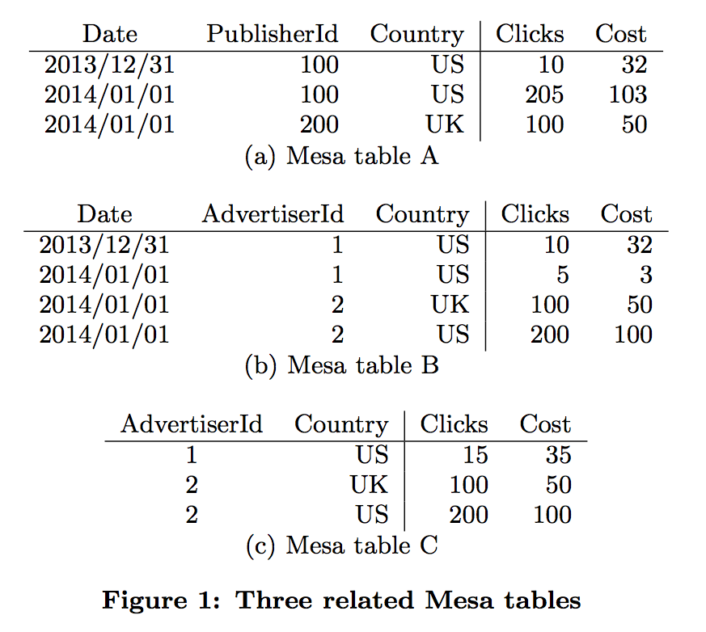
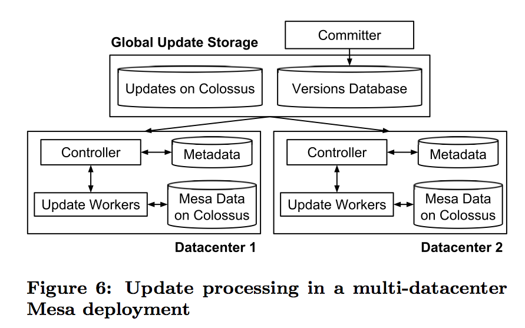
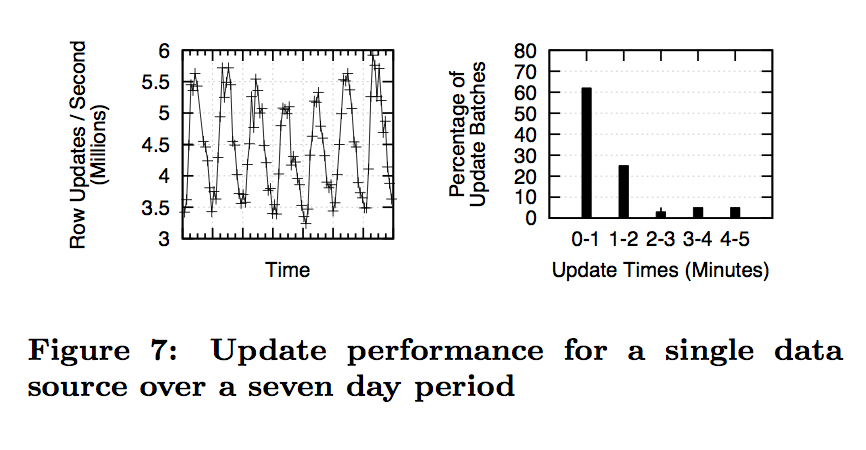
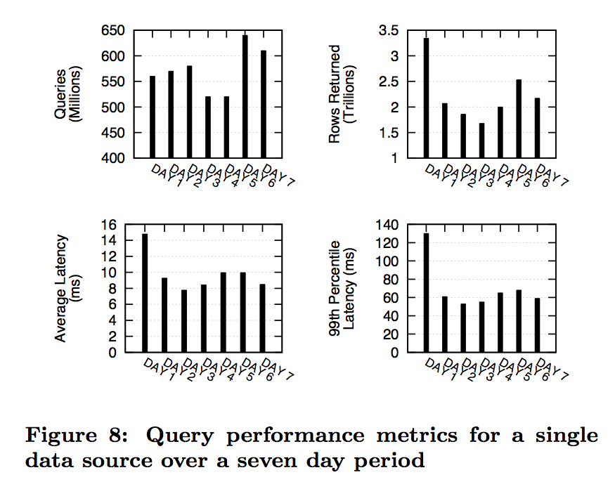
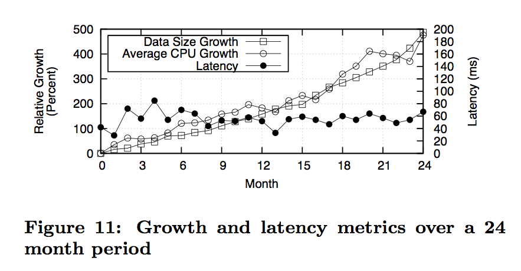

# Mesa: 全球备份, 近乎实时, 可拓展数据仓库

> 翻译自 [Mesa: Geo-Replicated, Near Real-Time, Scalable Data Warehousing](http://static.googleusercontent.com/media/research.google.com/en//pubs/archive/42851.pdf)

  Ashish Gupta, Fan Yang, Jason Govig, Adam Kirsch, Kelvin Chan, Kevin Lai, Shuo Wu, Sandeep Govind Dhoot, Abhilash Rajesh Kumar, Ankur Agiwal, Sanjay Bhansali, Mingsheng Hong, Jamie Cameron, Masood Siddiqi, David Jones, Jeff Shute, Andrey Gubarev, Shivakumar Venkataraman, Divyakant Agrawal

  Google, Inc.

## 概述

Mesa是一个高度可拓展的分析数据仓库，它存储了与Google互联网广告业务相关的关键数据。Mesa是设计用于满足用户和系统复杂和具有挑战性的需求集，其中包括近乎实时的数据输入和查询，同时要实现大数据和查询集的高可用、可靠性、错误容忍性和可拓展性。特别的是，Mesa能处理PT级的数据，每秒完成数百万行数据的更新，每天服务几十亿次查询和万亿次数据读取操作。Mesa能够夸多个数据中心备份，并且在低延时提供一致的和可重复的请求响应，即使一整个数据中心垮了也没问题。这篇论文介绍了Mesa系统并报告了它所实现的性能和可拓展性。

## 1. 介绍

Google在多个地域运行着一个可拓展的广告平台，它每天为全球的用户提供数十亿广告服务。与每个广告相关的详细信息，例如目标的标准、给人留下印象和点击的数量等等，都会实时记录并处理。这些数据广泛地用在Google不同的用例上，包括报告、内部审计，分析，计费和预测。广告要在推广效果上获得良好的效果，必须通过与复杂的前端服务交互来解决对底层数据的在线和按需查询。Google的内部广告服务平台使用实时数据来确定预算和之前已经上线的广告性能，用以提高现在和未来广告服务的相关性。作为Google广告平台就需要继续拓展，而作为内部和外部用户则要求对他们广告行为更大的可视化，对更多细节和细粒度信息的需求导致了原始数据大小的急速增长。可拓展性和数据的重要性导致了针对处理、存储和查询的技术和可操作性的独特挑战。对这种数据存储的需求如下：

**原子性更新。**一个单独的用户行为可能导致对相关数据的多次更新，影响着数千个一致性的视图，这些视图由一些指标集组成（如点击和花费）而且跨越一系列维度（例如广告商和国家）。它绝不可能在部分更新完成时就查询到系统的某个状态。

**一致性和正确性。**由于商业和法律的原因，这个系统必须返回一直而且正确的数据。我们要求强一致性并且是可重复的，即使这个请求跨越了多个数据中心。
 
**可用性。**这个系统必须没有单点故障。在预计和没有预计到的维护和失败下也没有停机时间，这包括整个数据中心或者整个地域停运的影响。

**近乎实时的更新吞吐量。**这个系统必须支持持续的更新，不管是新的行数据还是对现有行的增量更新，在一秒内数百万行数据的顺序上实现更新。这个更新操作在几分钟内对跨越不同视图和数据中心的一致性请求都必须是有效的。

**查询性能。**这个系统必须支持对延时敏感的用户，为有低延时需求的用户和要求高吞吐的批处理用户服务。总而言之，这个系统必须支持单点查询在99%的情况下延时低于几百毫秒，并且总体的查询吞吐量一天要达到数万亿行。

**可拓展性。**这个系统必须能够随着数据量和请求数的增长而拓展。例如，它必须能够支持万亿行和PT级的数据。更新和查询的效率必须在这些数据增长得很大时维持住。

**在线数据和元数据转换。**为了支持新的特性和对现有数据粒度的改变，客户端通常要求改变数据Schema或者修改现有数据的值。这些改变必须不会影响到普通的查询和更新操作。

Mesa是Google对于这些技术性和可操作性难题的解决方案。即使这些需求的子集已经被现有的数据仓库解决了，Mesa是唯一同时为商业关键数据解决所有这些难题的。Mesa是一个分布式、可备份并且高可用的结构化数据处理、存储和查询系统。Mesa处理由上层服务生成的数据，聚合然后持久化这些数据到内部，并且通过用户的查询提供数据的服务。即使这篇论文大部分都在讨论将Mesa应用在广告系统中，Mesa其实是一个通用的数据仓库解决方案，用以满足上述的所有需求。

Mesa综合了Google的基础架构和服务，例如Colossus（Google的下一代分布式文件系统）[22, 23]、BigTable[12]和MapReduce[19]。为了实现存储的可拓展性和可用性，数据进行水平分区和复制。更新操作将应用在单个表或者多个表的粒度上。为了实现在更新时一致而且可重复的查询，底层存储的数据都是有多个版本的。为了实现可拓展的更新，数据更新都是批量处理、同时分配一个新的版本号和周期性（例如每几分钟）合并到Mesa中。为了实现在多个数据中心之间更新的一致性，Mesa使用基于Paxos[35]的分布式同步协议。

大部分基于关系型技术和数据魔方[25]的商业数据仓库都不支持每隔几分钟连续的数据集成和聚合，同时不能对用户的查询提供几乎实时的响应。通常，这些解决方案与传统的企业氛围相关，他们不太频繁地将数据聚合到数据仓库，例如一天或者一周一次。相似的，没有Google处理大数据内部技术可以应用于此，例如BigTable[12]、Megastore[11]、Spanner[18]和F1[41]。BigTable不支持Mesa应用的原子性需求。同时Megastore、Spanner和F1（这三个都是针对在线的事务处理）能够在全球同步的数据中提供强一致性，但他们不支持Mesa客户端要求峰值更新吞吐量。然而，Mesa借鉴了基于Spanner的BigTable和Paxos技术用于存储和管理元信息。

最近的研究结果也要求数据分析和数据存储要能够动态拓展。Wong[49]已经开发了一个系统可以在云中提供大批量并行分析服务。然而，这个系统是设计与多租户的环境，它有大量用户和相对较小的数据痕迹。Xin[51]已经实现了Shark利用分布式共享内存来支持拓展数据分析。然而Shark只专注于内存中的处理和分析性查询。Athanassoulis[10]已经提出了MaSM（物化排序合并）算法，它可用于结合闪存存储设备来支持数据仓库的在线更新。

这篇论文的关键贡献在于：

* 我们展示了我们如何创建一个PT级数据仓库系统，它支持需要事务处理的ACID语义，并且能够拓展到好大的吞吐量来处理Google的广告指标。

* 我们介绍了一个版本管理系统，它通过批处理更新来实现更新操作的低延时和高吞吐量，查询操作也达到同样低延时高吞吐量的性能。

* 我们描述了一个高度可拓展的分布式架构，它在一个数据中心对于机器和网络失败可以弹性容忍。我们同样展示了解决数据仓库错误的全球同步架构。与我们的设计有所区别的是应用数据是通过在独立而且冗余的多个数据中心异步备份，然而只有关键的元数据是通过复制状态同步到所有副本。这种技术最小化了在多个数据中心管理副本的开销，同时提供了非常高的更新吞吐量。

* 我们展示了如果动态而有效地改变大量表的Schema，同时不影响已存在应用的正确性和性能。

* 我们描述了用于承受软硬件故障导致的问题和数据损坏的关键技术。

* 我们 描绘了维护一个可拓展系统的一些可操作性挑战，在正确性、一致性、性能强和新研究能做贡献的领域来提高最先进的技术。

论文其他部分的组织如下。第二部分描述Mesa得存储子系统。第三部分展示Mesa系统的架构和它的跨数据中心部署。第四部分展示Mesa的一些高级功能和特性。第五部分报告Mesa开发的经验，而第六部分报告Mesa生成环境下部署的指标。第七部分回顾了相关同坐，而第八部分总结这篇论文。

## 2. Mesa存储子系统

Mesa中的数据是持续生成的，它是Google最大而且最有价值的数据之一。对这些数据的分析查询有简单的查询，如“在特定一天某个特别广告商的广告有多少点击率？”，或者是更多查询的场景，如“在十月第一个的8点到11点显示在google.com针对美国地区使用移动设备的广告商有多少广告点击率？”

在Mesa中数据本质是多维的，它包括在Google广告平台多维度的细微的数据。这些数据主要由两种属性组成：多维属性（我们成为键）和度量属性（我们成为值）。细微很多维度属性是分层的（并且甚至有多个层次等等，数据维度能以日/月/年或者财政的周/季/年来组织），一个单个数据局域这些维度层次可以聚合到多个物化视图中，它支持数据的向下聚合和向上聚合。一个稳定的数据仓库设计要求单个属性的存在是一致的，不管经过任何可能的方式进行物化和聚合。

### 2.1 数据模型

在Mesa中，数据是使用表来管理的。每个表有一个用于指定其结构的Schema。特别的是，一个表Schema指定了表的键空间K和相关的值空间V，而K和V都是集合。表的Schema也指定函数F : V x V-> V，它用户聚合相同键的所有值。这个集合函数一定要是相关的（例如对于所有值F且v0 , v1 , v2 ∈ V，（F(v0,v1),v2) = F(v0,F(v1,v2)）实际上，它通常也是交换的（例如F(v0,v1) = F(v1,v0)），尽管Mesa确实有不可交换集合函数的表（例如F(v0,v1) = v1来替换一个值）。这个Schema也用于指定表的一个或多个索引，这些索引都是在K中的全排序。

键空间K和值空间V代表着每个列的多个元组，每个元组有一个固定的类型（例如int32、int64、字符串等等）。Schema为每个独立的值列指定了一个相关的聚合函数，而F是隐式定义为智能聚合坐标的值列，例如：F((x1,...,xk),(y1,...,yk)) = (f1(x1,y1),...,fk(xk,yk))，其中(x1,...,xk),(y1,...,yk) ∈ V是列值的任意两个元组，而且f1到fk是Schema为每个值列显示定义的。

举个例子，图1显示了三个Mesa表。这三个表都包含了广告点击和成本指标（值列），而且通过各种属性细分了，例如点击的数据、广告商、展示这个广告的网站和国家（键列）。这个用于所有值列的聚合函数就是SUM累加。所有指标在这三个表中是一致的，假设相同的底层事件在所有的这些表更新了数据。图1是Mesa表Schema的简化视图。在生产环境中，Mesa包含超过一千个表，大部分的表拥有数百个列，而且使用各种聚合函数。

### 2.2 更新和查询

为了实现很高的更新吞吐量，Mesa批量地调用更新。这些更新的批量包是在Mesa外部的上游应用产生的，典型的是按几分钟的频率产生（更小更频繁的批量包能实现更低的更新延时，但消耗更多的资源）。通常，对Mesa的一个更新操作指定一个版本号n（从0开始按顺序分配），和一个表单包含的行集合（表名、键和值）。每个更新操作对每个列包含最多一个聚合值。

对Mesa的一个查询操作包含一个版本号n和在键空间的一个谓词P。而响应包含对于每个匹配P的键的一行，它出现在版本在0到n的更新中。响应中一个键的值是聚合了在那些更新中的所有值。Mesa实际上支持比这个更复杂的请求功能，但这些全部都能看做是这个原语的前置操作和后置操作。

举个例子，图2显示了两个针对图1定义的表的更新操作，当聚合在表A、B和C。为了维护表的一致性（在2.1部分讨论到），每个更新操作包含两个表A和B的一致行行。Mesa自动对表B处理这些更新操作，因为它们能直接从表B的更新中衍生出来。理论上，单个更新操作包括广告ID和出版商ID属性能够用于更新三个表，但那样的操作太重了，尤其是在更通用的例子中各个表都有很多属性（例如是一个交叉的产品）。

注意表C响应了一个物化的视图，对于表B进行以下的查询操作：SELECT SUM(Clicks), SUM(Cost) GROUP BY AdvertiserId, Country。这个查询可以直接表示为一个Mesa表，因为在查询中使用SUM函数匹配了使用SUM作为聚合函数处理表B的值列。Mesa限制了物化视图来使用相同的聚合函数，处理父表的指标列。

为了实现更新的原子性，Mesa使用一个多版本的方法。Mesa按版本顺序来执行更新操作，确保在移至下一个更新操作前原子性地合并更新操作。

更新操作的严格顺序在原子性以外还有更多的应用。实际上，在Mesa的Schema上的聚合函数可能不能交换，例如在标准的键值存储中一个键值的更新会完全覆盖这个键以前的所有值。更巧妙的事，这种有序的约束允许Mesa支持不同的实例，包括不准确的因素可能是相反的行为。特别的是，Google使用在线的伪删除来确定一个点击是否有效。伪点击是有负面因素的偏移。举个例子，可能在有一个版本2的更新更随在图2的更新以后，它包括负面点击和成本，相应地标记之前的广告点击为不合法的。通过确保更新的严格顺序，Mesa保证了负面的因素在正面处理之前从不被注册。

### 2.3 版本化数据的管理

版本化数据在Mesa的更新和查询中都是非常重要的一环。然而，它也面临着多种挑战。第一，根据广告数据的聚合本质，独立地存储每个版本从存储的角度是非常浪费的。聚合的数据在传统中能够做得更小。第二，在查询的时候访问各个版本并且聚合它们是很重的而且增加了访问延时。第三，原生的在每次更新时对所有版本的预聚合可能变成非常的重。

为了处理这些挑战，Mesa预聚合某些版本化数据然后存储它，数据存储时包含一个行集合（没有重复的键）和特定版本（或者更简单的一个版本），这是通过[V1,V2]来表示的，V1和V2是更新的版本号，而且V1 ≤ V2。我们更倾向于某个版本当它的含义是清晰的。在[V1,V2]中的行对应了键的集合，这些键出现在更新操作而且它们的版本号在V1和V2之间（包括前后）。每个键的值是它们更新中值的聚合。更新操作在Mesa中会合并成单体（或者更简单的单体）。对于单体这个版本[V1 , V2]对应了一个版本号n的更新，而且通过设V1 = V2 = n。

一个版本[V1, V2]和另一个版本[V2 + 1, V3]能够聚合到版本[V1, V3]，通过简单地合并行键和因而聚合值。（已经在2.4部分讨论过，行是通过键和其他两个版本能够在线性时间中合并。）这个计算的正确性跟随在相关的聚合函数F后。值得注意的是，正确性不依赖于F的可交换性，而Mesa对给定的键聚合两个值中，这个版本总是在表单[V1 , V2] and [V2 + 1, V3]中，而且聚合是执行在版本的递增顺序中。

Mesa允许用户在一个特定的版本中查询一个限制的时间段（例如24小时）。这就意味着在这个时间段前的版本可以聚合到新的基版本中（或者简单地成为基点）和版本[0, B]对于B ≥ 0的版本而言，并且这以后的所有版本[V1, V2]其中0 ≤ V1 ≤ V2 ≤ B都可以被删除。这个过程称为基点聚合，而且Mesa根据其他操作来同步和异步地执行它（例如合并更新和响应查询）。

记住这是为了合并的目的，与更新版本相关的时间是那个版本产生的，而且是独立于数据中可能存在的任何时间序列信息。例如，在图1中的Mesa表，与2014/01/01关联的数据从没有被删除。然而Mesa在一段时候后可能拒绝查询特定的版本。数据中的日期是对Mesa不透明的另一个属性。

有了基准合并，为了响应版本号为n的查询，我们能够聚合基准增量[0, B]，而所有单个增量为[B + 1, B + 1]、[B + 2, B + 2]到[n, n]，然后返回请求的行。即使我们频繁地（例如每天）运行基准拓展（译者注base expansion），所有单体（译者注singletons）的数量仍然很容易就到几百（或者甚至几千），尤其是更新密集的表时。为了支持更有效的查询操作，Mesa在表单[U, V]中维护了一系列累计的增量D，其中在称为累计合并的过程中B < U < V。这些增量能够用于找到增量{[0, B]、[B+1, V1]、[V1 +1, V2]到[Vk +1, n]}对于某个版本n的跨越集（译者注spanning set），它要求比简单使用单体更少的聚合。当然，关于累计增量有存储和处理的开销，但这开销是均摊到所有操作中（尤其是查询），这允许使用它们的增量而不是单体。

增量合并策略决定了当时由Mesa维护的增量集。它的主要目的是均衡一次查询所必须做的处理，对更新带来的延时可以加入到Mesa的增量中，与生成和维护增量相关的处理和存储开销也是。更具体的是，增量策略决定了：（1）什么增量（不包括单体）必须在允许更新版本来查询（在更新路径中同步，查询更快的同时减缓更新）之前产生。（2）什么增量应该在更新路径外异步地生成。（3）什么时候能够删除增量。

增量合并策略的一个例子是在图3显示的两层策略。在这个策略例子中，在时间的任意点有一个基准增量[0, B]，累计增量的版本[B + 1, B + 10]、[B + 1, B + 20]、[B + 1, B + 30]等等，而每个版本的单体增量都大于B。累计的[B+1, B+10x]在版本B+10x出现后尽快地异步生成。阿哥新的基准增量[0, B′]大约每天都会计算，但新的基准增量知道与它相关的B′生成后才能被使用。当基准版本B变为B′，这个策略删除旧的基准、旧的累计增量和所有版本小于或者等于B′的单体。然后一个查询将调用基准、一个累计数和一些单体，并减少在查询时间内的工作量。

Mesa目前在生产环境中使用两层增量策略的变体，使用多层的累计增量。在最近的版本中，累计增量组合了少量单体和旧版本的累计增量组合了大量的版本。例如，一个增量层次结构可能维护一个基准（译者注base），然后是后面100个版本的增量，然后是后面10个版本的增量，跟随着单体。存储管理相关的方法也能用于其他只允许插入的基于日志结构的存储系统，例如LevelDB[2]和BigTable。我们记住Mesa基于不同更新的数据管理是不同存储Schema[40]的简化采用，它也能用于增量的师徒管理[7, 39, 53]和更新的读存储[28, 44]。

### 2.4 物理数据和索引格式

Mesa增量是基于增量合并策略创建和删除的。一旦增量已经创建，它是不可修改的，因此它的物理格式无需支持增量的修改。

Mesa增量的不可修改性允许它们使用相当简单的物理格式。主要的要求是仅仅是这个格式空间利用率高，作为存储系统这是Mesa的主要成本，而且它必须支持快速索引到一个特定的键，因为一次查询经常包括几个增量的定位和跨键的聚合。为了开启有效的按键定位，每个Mesa表都有一个或多个表索引。每个表索引都有它自己数据的拷贝，它是根据索引顺序来排序的。

这个格式本身的细节是有很多技术环节，所以我们就只关注最重要的方面。增量中的行是按顺序保存在固定大小（为文件系统文件大小限制而优化）的数据文件中。那些行本身组织成行块，每一个行块都是独立地传输和压缩。传输会通过列而不是行来规划数据进行更好的压缩。因为存储是Mesa的主要成本，而在读和查询中解压缩的性能超过写时压缩的性能，在我们选择压缩算法的时候我们强调压缩率和读、解压缩的次数而不是写、压缩的次数。

Mesa也存储和每个数据文件相关的索引文件。（定位每个数据文件对于高层次的表索引是具体的。）一个索引项包含行块的短键（译者注short key），它是这个行块第一个键的固定大小的前缀，和这个数据文件中压缩的行块的偏移量。请求一个特定键的原本算法是在索引文件中的二分查询，它能找到行块可能包含匹配查询键的短键的范围，在对压缩到行块的数据文件进行二分查询后找到想要的键。

## 3. Mesa系统架构

Mesa是使用Google通用的基础架构和服务构建的，包括BigTable[12]和Colossus[22,23]。Mesa运行在多个数据中心里，每个数据中心运行一个Mesa实体。我们从描述实体的设计来开始。然后我们会讨论这些实体是怎样集成构建一个完整的跨数据中心Mesa部署系统。

### 3.1 一个数据中心实体

每个Mesa实体是由两个子系统组合而成：跟新管理和查询系统。这些子系统是解耦的，允许他们独自拓展。所有持久化的元数据都存储在Bigtable而所有的数据文件都存在Colossus。对于运行的正确性，这两个子系统之间不需要直接的通信。

#### 3.1.1 更新和维护子系统

更新和维护子系统提供所有必须的操作来学报在本地Mesa实例中的数据是正确的、最新的和为查询优化的。它运行多个后台操作，例如载入更新、执行表合并、执行Schema的修改和运行表的错误校验。这些草果都是由图4展示的一个被称为控制器、工作组件框架来管理和执行。

控制着决定了需要做的工作和管理所有表的元数据，这些元数据持久化到BigTable的元数据中。表的元数据包含详细的状态和对于每个表的操作性元数据，包括所有增量文件的项和当前和以前按类型划分的已执行操作的统计项。

控制着能够认为是一个大规模表的元数据缓存、工作调度者和工作队列管理者。控制着不执行任何实际的操作表数据的工作，它只调度工作和更新元数据。刚开始，控制者从BigTable中载入表元数据，这包括所有分配到本地Mesa实例的表的项。对于每个已知的表，它订阅了元数据的信息来监听表的变化。新的元数据更新会进行验证和记录。控制着在BigTable中唯一一个写表元数据的。

控制着为不同类型的数据操作工作（例如合并更新、增量合并、修改Schema和表的校验）维护独立的内部队列。对于制定单个Mesa实例的操作，例如合并更新和增量合并，控制着决定什么工作压入队列。而要求全局协调的应用或者全球同步的工作，例如修改Schema和表的校验，是由其他运行在单个Mesa实例的环境中初始化的。对于这些任务，控制着通过RPC接受工作请求，并且将这些工作信息插入到相应的内部工作队列中。

工作组件（译者注worker）是负责在每个Mesa实例中执行数据操作的工作。Mesa对于每种任务类型有一个独立的工作组件池，允许每个工作组件池独立地拓展。Mesa使用内部的工作组件池调度器，它根据空闲可用的工作组件来拓展工作组件的数量。

每个空闲的工作组件周期性地为与它相关的任务类型轮询控制着来请求工作，知道找到了有效的工作。一旦接收到有效的工作，工作组件验证这个请求、处理获得的工作并且在工作完成时通知控制者。每个任务都有相关的最大拥有时间和周期性更新的协约，它用于确保慢或者挂了的工作组件不会永久地拥有这个任务。以上两个条件其中一个不满足控制者都会重新分配任务，这是安全的因为控制着只会从它分配的工作组件中接收任务结果。这确保了Mesa能够容忍工作组件的失败。一个垃圾回收程序会持续运行来删除由于工作组件失败留下的文件。

因为控制着、工作组件框架只用于更新和维护工作，这些组件能够重启而不影响内部的用户。同样的，控制着本身是通过表来共享的，它允许这个框架拓展。而且，控制者是无状态的，所有状态信息都是持久化在BigTable中。这确保了Mesa能够容忍控制着失败，因为一个新的控制能能够从BigTable中的元数据重新构建状态。

#### 3.1.2 查询子系统

Mesa的查询子系统包括查询服务器、展示在图5中。这些服务器接受用户的查询、寻找表的元数据确定要求的数据所存储的文件集、执行这些数据的聚合和在发送数据块给客户端之前从Mesa内部的格式转换为客户端协议的格式。Mesa的查询服务器提供了一个有限制的查询引擎，它仅支持服务端条件的过滤器和分组的聚合。高层次的数据库引擎例如MySQL [3], F1 [41], and Dremel [37]使用这些原语来提供更丰富的SQL功能例如关联（译者注join）查询。

Mesa的客户端有大量不同的需求和性能特征。在一些用例中，Mesa直接从交互的终端直接接受查询，它有着非常严格的低延时需求。这些查询通常是很小的，但必须几乎马上能响应。Mesa也从大规模任务中接受查询，例如每天的离线报告，它每天发送几百万条请求并得到数十亿行数据。这些查询要求很高的吞吐量和典型地对延时不敏感（几秒或几分钟的延时是可以接受的）。Mesa确保这些延时和吞吐量的需求能够被满足，通过要求工作被适当地标记然后在查询服务器的独立和优先级机制中使用他们的标记。

单个Mesa实例的查询服务器组织在不同的集合 ，每个集合有手机能力来服务控制者管理的所有表。通过使用多个查询服务器的集合，很容易就可以查询服务器的更新（例如二进制发布）而无需等待延时敏感的客户端，它能够自动处理失败并转移到同一个（甚至是不同）的Mesa实例中的其他集合。在一个集合里，每个查询服务器能够处理所有表的查询。然而，因为性能的原因，Mesa更愿意转移对相似数据（例如所有查询都是同一个表）的查询到查询服务器的一个自己。这种技术允许Mesa提供很强的延时保证，同故宫允许有效的查询服务器在内存中预读取和缓存存储在Colossus的数据，同时也允许很好的总体吞吐量，通过均衡多个查询服务器之间的负载。在开始时，每个查询服务器通过一个全局定位服务器注册它缓存的表列表，这个服务也用于客户端发现查询服务器。

### 3.2 多个数据中心的部署

Mesa为了提供高可用性，它能够部署在全球各个大区中。每个实例是独立的，而且保存了数据的独立拷贝。在这个部分，我们介绍了Mesa架构的全球性方面。

#### 3.2.1 一致性更新机制

在Mesa中所有表都是有多个版本的，允许Mesa在之前的状态中继续提供一致的数据，即使有新的更新正在被执行。一个上流应用批量地生成更新要加入Mesa的数据，一般是每个几分钟一次。正如表6所展示的那样，Mesa的提交负责对全世界所有Mesa实例协调更新操作，每次一个版本。提交者为每次批量更新分配一个新的版本号，并发布与这次更新相关的所有元数据（例如这个文件包含的更新数据的位置），给版本数据库，这是基于Paxos[35]一致性算法的一个全球同步和一致性数据存储。提交者本身是无状态的，给定运行在多个数据中心的实例来保证高可用性。

Mesa的控制者监听版本数据的改变，检查新更新的可用性，分配相关的工作给更新工作组件，报告更新版本数据库的成功合并。提交者不断检查提交标准是否已经达到（具体来说就是更新时候有足够多的跨全球多个区的Mesa实例通过）。提交者在更新中位Mesa的所有表执行提交标准。这个属性对于维护相关表的一致性是必需的（例如一个Mesa表是另一个Mesa表的物化视图）。当提交标准一定达到，提价这声明更新的版本号为提交版本号，并存储这个值到版本数据库中。新的查询总能找到这个提交版本。

Mesa更新机制的设计对性能有着有趣的影响。首先，因为所有新的查询都会定位到提交的版本，而且更新是批量处理的，Mesa在查询和更新中不需要任何的锁。第二，所有更新数据都是异步合并到多个Mesa实例中，只有元数据是通过同步备份到基于Paxos的版本数据库。结合起来，这两个属性允许Mesa同时实现很大的查询和更新吞吐量。

#### 3.2.2 新的Mesa实例

因为Google构建新的数据中心并且使用旧的，我们需要运行起新的Mesa实例。要初始化新的Mesa实例，我们使用一个点对点的载入机制。Mesa有一个特别的载入工作组件（类似在控制器工作组件框架下其他的工作组件），它从另一个Mesa实例中拷贝表到当前的实例。Mesa然后使用更新工作组件来获得最新提交的表版本，这都是在允许它进行查询之前完成。在初始化期间，我们做这件事来导入所有表到新的Mesa实例。Mesa也使用相同的点对点导入机制从表损坏中恢复。

## 4. 高级部分

在这个部分，我们会描述Mesa设计的一些高级特性：在处理查询时的性能优化、并发工作组件的操作、在线修改Schema和确保数据有效性。

### 4.1 请求服务器的性能优化

Mesa的查询服务器进行增量的清理，这是在查询服务器检查描述每个增量的键范围的元数据时。如果请求的过滤器落在这个范围以外，这个增量可以完整地被清除。这个优化对于指定最近时间的按时间序列查询是特别有效的，因为这些查询可以频繁地完整删掉基准增量（在通常的例子中行键中的数据列至少大概与这个列最近的更新时间相关）。同理，在时间序列的数据指定请求以前时间的请求通常能够清理累计增量和单体，并且总基准中得到完整的响应。

一个查询不能够在第一个键列中指定过滤器，它典型地需要对整个表的扫描。然而，对于在其他键列中有过滤器的某些查询，我们也能够使用扫描定位优化来从索引中获得好处。例如，对于一个表拥有索引键列A和B，过滤器B，在表中每一行都需要扫描。扫描定位事务是基于观察的，在B以前（这个例子中只有A）的键列的值组成一个前缀，所以允许定位到下一个可能匹配的行。例如，假设表中A的第一个值是1.在扫描定位事务的过程中，查询服务器使用索引来查找所有有键前缀(A = 1, B = 2)的行。这保证A=1而且B<2。如果A的下个值是4，那么查询服务器能够跳过(A = 4, B = 2)等等。这个优化能够大大提升查询的速度，不过依赖于B所剩下的键列。

Mesa查询服务器的另一个趣点是保留键的概念。Mesa典型地在一个流中返回数据给客户端，每次一个块。而每一个块，Mesa都附上一个保留键。如果一个查询服务器不可响应了，受影响的Mesa客户端能够马上切换到另一个查询服务器，从保留键中恢复查询而不是重新执行整个查询。记住查询可以在任意Mesa实例中恢复。这极大地得益于可靠性和可用性，尤其是在云环境中独立服务器可能在任何时候离线。

### 4.2 并发工作组件的操作

Mesa的控制器、工作组件框架包括协调不同类型工作组件的控制器，它用于指定解决一个特定的操作，包括读或者写Mesa的数据到单个Mesa表。

对于任意特定的操作，顺序处理TB级别高度压缩的Mesa表数据可能花费超过一天去完成。这在Mesa中产生了重大的拓展性瓶颈，在Mesa的表大小不断增加的情况下。为了实现更好的拓展性，Mesa使用了经典的MapReduce框架[19]来并行处理不同类型的工作巨剑。这里其中的一个挑战是跨多个映射者（译者注mapper）和归化者（译者注reducer）中工作的分区。

为了开启同步，当写任意增量时，一个Mesa工作组件对各第s个行键取样，其中s是一个参数，我们后面将会介绍。这些行键样本保存在增量中。为了跨多个映射者并行读一个增量，MapReduce首先会决定增量的一个集合，它能够被聚合来提供想要的版本，然后读和合并这个增量的行健样本，在这个集合中确定那些跨多个映射者的平衡的分区。分区的数量是根据任意映射者数据的数量而选择的。

主要的挑战是定义s以致于MapReduce必须处理的样例数目是合理的（去减少映射者的负载均衡），同时保证没有映射者分区大于一些固定的阈值（为了确保并发）。假设我们有m个增量，在针对特定版本的集合中，一共有n行数据，而且我们希望有p个分区。理想情况下，每个分区应该是n/p这么大。我们定义每个行健样本大小为s。然后我们从集合中的增量合并所有样本，需求倪泽一个行健样本作为分区的边界，无论当前分区这个样本大小的综合是否超过n/p。这里主要观察在一个特定增量中行健的数量是否合适，在当前累计的大小最大是s（如果当前行健样本从特定增量中获取则为0）。总的错误则在(m − 1)以内。因为大部分增量版本能够跨越m（支持快速查询）中很小的值，我们能够支持一个集合未s设置大值来补偿分区的不平衡，这是由于分区数量的增加而导致的。由于s是大值而且确定取样率（例如每s行中取一个），样本被MapReduce读的总数是很小的。

### 4.3 Mesa修改Schema

Mesa用户经常需要Mesa表中的Schema（例如支持新的特性或者提高查询性能）。一个普遍的修改Schema方式包括增加或者去掉列（包括键和值），增加或者移除索引和增加或者移除整个表（特别是创建聚合表，例如从之前已经存在的日度表中创建一个月度的物化视图）。每个月有数百个Mesa的表改变了Schema。

因为Mesa数据的更新程度和可用性对Google的业务至关重要，所有Schema的修改都必须是在线的：无论是查询还是更新都不应该在改变Schema期间而推延。Mesa使用两种主要技术来实现在线的Schema修改：一个简单但很重的方法能够满足所有用例，一个优化的方法能够满足很多重要的通用用例。

Mesa用户在线修改Schema的普通方法是（1）创建这个表一个独立的拷贝，使用固定的更新版本在新的Schema版本中保存数据，（2）同时响应这个表的所有更新，直到新的Schema版本是当前值，（3）切换新的查询使用的Schema版本，用新的Schema版本作为BigTable中元数据操作的原子控制着。旧的查询可以在一段时间内继续运行在旧的Schema版本，知道旧的Schema版本被抛弃。

这种方法是可靠的但很重，尤其是这个Schema改变包含了很多表。例如，假设一个用户希望在相关的表中添加一个新的值列。这种Schema修改方法要求两倍的磁盘空间和在改变Schema过程中更新和合并处理。

相反，Mesa提供了一种连接修改Schema来解决这个用例，通过把旧的和新的Schema版本认为是一个更新、合并。确切来说，Mesa使Schema的变更对新的查询马上课件，在查询时解决对新Schema版本的转化（为新的列使用默认值），并且相似的写所有新的增量在整个表中用新的Schema版本。所以，一个连接Schema变更能够省下50%的磁盘空间和更新、合并资源，当和前面的方法对比的时候。连接Schema变更不适用了某些用例，例如当一个Schema变更改变了现存表键列的排序，必须对已存在的数据重新排序。除了这个限制，连接Schema变更在普通类型的Schema变更保护资源（并且加速Schema变更进度）中是有效的。

### 4.4 缓解数据损坏问题

Mesa在云端使用了上万台服务器，他们都是独立管理，并且在Google中共享很多服务同存储和处理数据。对于任意的计算，总有一种负面的可能性是错误的硬件或者软件会导致产生或者存储不一致的数据。简单的文件级别的校验要定位这些事件没有效率的，因为这种损坏可能瞬间发生在CPU和内存中。在Mesa的集群，这些看上去小概率的时间是很常见的。防卫这些损坏是Mesa总体设计的重要目标。

尽管Mesa能够全球部署多个实例，每个实例都独立地管理增量版本。在逻辑层所有的实例保存相同的数据，但具体的增量版本（和它们的文件）是不同的，Mesa管理这些不同来应对错误的机器和在在线和离线数据验证过程中的人为错误，它们都展示在正确性和成本中不同的取舍。在线检查在每次更新和查询操作中完成。当写增量时，Mesa执行行顺序、键范围和聚合值的检查。因为Mesa增量是按顺序存储，显式写Mesa增量的类库保证这个属性，违规会导致相关的控制者、工作组件不断重试。当生成累计增量时，Mesa组合了键范围和跨越增量的聚合值，并且检查它们是否匹配输出的增量。这些检查发现在Mesa数据中少见的数据损坏，在计算期间而不是存储时。它们能够发现在实现计算时的缺陷。Mesa的稀松索引和数据文件也存储每个行块的校验信息，Mesa会检验一个行块是否被读。索引文件本身也包含了头部和索引数据的校验信息。

除了这些单个实例的验证，Mesa会周期性地执行全球离线检查，最综合的是哪一个是全球跨多个实例表索引的校验。在这个过程中，每个Mesa实例会计算一个很强的依赖行顺序的校验和一个很弱的不依赖行顺序的校验，未一个特定版本的每一个索引，和一个全球组件验证表数据是否跨索引和实例都是一致的（即使底层文件的数据可能不一样）。Mesa在有校验不匹配的时候会产生警告。

作为一个轻量级的进程，Mesa也运行一个全局的聚合数据检测，它计算越过在每个Mesa实例最新提交版本的每个索引的集合、从那些增量元数据读聚合的值和聚合它们来验证跨所有索引和实例的一致性。因为Mesa执行这个操作在完整的元数据，这比对整个全局校验更加有效率。

当一个表损坏时，一个Mesa实例能够自动从其他实例从新加载这个表没有损坏的拷贝，通常是从附近的数据中心。如果所有实例都损坏了，Mesa能够从这个表较老的版本中的备份恢复，并且响应随后的更新操作。

## 5. 经验和教训

在这个部分，我们快速地介绍我们在过去几年构建大规模数据仓库系统学到的关键经验。一个关键点就是当设计大规模可拓展基础架构时做好对未知意外的准备。而且在生产环境中，有很多低概率而且能导致重大故障的事件发生在我们的集群中。下面是我们按领域分组的经验教训，不过也不是面面俱到。

**分布式，并发和云计算。**Mesa能够管理高速率的数据增长，通过它在分布式和并发原理上的绝对可靠性。结合去中心化的架构的云计算原语已经被证实在数据和请求拓展时时很有用的。从特定的高性能专用服务器移到由通用计算机组成的新环境在整体的系统性能上有很多有趣的挑战。我们需要新的方法来解决这个环境下普通计算机有限的容忍性，而这些通常在专用高性能服务器运行得很好的技术在这个环境可能就不能工作了。举个例子，现在的数据分布在大约上千台服务器上，Mesa的查询服务器积极地从Colossus中预读数据，并且使用很多原语来减少从本地磁盘到Colossus迁移数据的性能下降。
 
**模块化，抽象和分层架构。**我们认为分层设计和架构是应对系统负责度最关键的，即使它可能要损失性能。在Google，例如Colossus和BigTable我们都从模块化和抽象底层架构受益，这允许我们专注于Mesa的架构组件。如果我们使用裸机从头开始建立Mesa将会大大提高我们工作的难度。

**容量计划。**从一开始，我们就对持续增长数据的做好计划和设计。当我们运行Mesa的前身时，它是直接构建在商业机器上的，我们发现我们应该能够更具项目数据的增长来预测我们的容量需求。然而，要有效地收购和部署特定的硬件是很有挑战性的。在Mesa中我们从Google基于云的标注基础架构转变到我们简单的容量计划。

**对应用层的假设。**当设计一个大规模基础架构时，给出关于应用的强保证必须非常小心。举个例子，当我们设计Mesa的前一个系统，我们就假设改变Schema是非常少的。这个假设最终发现是错的。因为一个公司，产品，服务和应用的产生的数据本质是一个持续的流。而且，新的应用程序可能有组织地加入也可能是被其他公司收购而继续支持。总而言之，我们的设计必须尽可能通过，对现在和未来的假设足够小。

**全球同步备份。**尽管我们在Mesa中支持大量数据的全球同步备份和系统可用性，我们也看到了每天操作这个概念的益处。在Mesa的前任系统中，有一个数据中心外围的计划好的停运，我们必须费力地将这24x7小时运行的系统迁移到另一个数据中心里。今天，这类计划好而且合理的停运已经对Mesa有很小的影响了。

**数据损坏和组件失败。**数据损坏和组件失败是Mesa系统拓展时一个重要的考虑点。数据损坏可能由于各种原因而发生，拥有必须的工具去预防和检测它们是很重要的。同样地，类似在机器上的浮点单元的错误组件是非常难诊断的。由于Mesa云主机是动态分配的本性，很难确保一个机器是不是一直处于服务状态。而且即使拥有错误单元的服务器被分配给了Mesa，使用它可能只会引起间歇性的问题。克服这些运维挑战仍然是一个未解决的问题。

**测试和增量部署。**Mesa是一个大型的、复杂的、关键的和持续优化的系统。同时管理新的特性和生产环境的正常是一个巨大的难题。幸运的是，我们发现通过组合一些标准的工程实践和Mesa总体的错误容忍架构和数据损坏的可靠性，我们能够以很小的风险持续地发布重大的提升。我们用到的一些技术是：单元测试、能够运行少量生产环境数据的私有开发者Mesa实体，和共享的测试环境，这个测试环境在上游运行大部分生产环境的数据。我们非常小心地对多个Mesa实体增量地部署新的特性。举个例子，当部署一个高风险的特性时，我们可能一次只部署到一个实体中。因为Mesa有指标来检测数据跨数据仓库的一致性（同样也有吞吐量监控和各组件的报警），我们发现我们能够很快地检测和解决问题。

**人为因素。**最后，我们面临着一个重要的挑战是，像Mesa这样的系统背后，都有一个很大的工程团队和继续加入的新员工。主要的挑战是怎样沟通来保证整个团队的认识都是最新的。我们目前依赖代码说明，单元测试，通用流程的文档，操作演练和对系统所有部分的交叉培训。目前为止，管理这些的复杂度和各种的责任持续地挑战我们个人和工程观点。

## 6. Mesa生产环境指标

在这部分，我们会汇报在Mesa生产环境中更新和查询的性能指标。我们显示七天周期的指标来展示它的变化和稳定性。我们也显示系统在几年周期的指标增长，来展示这个系统是如果拓展来支持数据增长带来的资源线性增长的要求，同时要满足要求的请求性能。总而言之，Mesa是一个高度分散而且在多个数据中心同步备份并且在一个数据中心使用成百上千服务器处理更新和请求处理。尽管我们没有汇报我们部署的属性细节，我们提供的架构细节已经是综合并且能够传递高度分布式、大规模系统的本质。

### 6.1 更新操作

图7展示了Mesa在七天的周期中一个数据中心内的更新性能。Mesa支持数百个并发的更新数据源。对于这个特别的数据源，Mesa平均每秒读取30到60MB的压缩数据，更新300到600万独立的行和增加大约30万新的行数据。这个数据源大约每5分钟产生批量更新操作，而Mesa提交时间的平均值和95%百分比之下分别是54秒和211秒。Mesa会管理这些更新延时，避免更新操作由于动态拓展资源而积压下来。

### 6.2 请求操作

图8展示了Mesa在与前面相同数据源7天内的请求性能。Mesa每天处理这些表超过5亿的请求，放回1.7T到3.2T行。这些产品查询的本源差异非常大，从简单的单点查询到大规模遍历。我们汇报他们平均和99%一下的延时，这显示了Mesa能在几百毫秒内响应大部分的查询。而导致平均和最大延时的巨大差异的因素有很多，包括请求的类型，请求服务器缓存的内容，瞬间的故障和云平台基础架构各层次的重试，甚至是偶然遇到很慢的服务器。

图9展示了处理请求的开销和同样是7天内我们在4.1部分讨论过的遍历查询优化效果。返回的行大概只有30%到50%读是由于版本合并和请求指定的过滤。遍历查询优化避免了解压和读60%到70%的本来需要处理的版本化行。

在图10，我们报告了Mesa查询服务器的可拓展属性。Mesa的设计允许组件通过参数化资源来独立地拓展。在这个检验中，我们假设请求吞吐量的服务器从4增加到128.这个结果确定了Mesa请求处理能力的线性拓展。

### 6.3 增长

图11展示了Mesa在24个月的周期中数据和CPU使用率的增长，这也是我们最大的生产数据集之一。总的数据量增加了几乎有5倍，通过更新率（这增加了超过80%）和增加的新表、索引和物化视图。CPU使用有着相似的提高，但也受到一次性的运算例如改变Schema和我们过去部署时优化的影响。图11也包括了用一个监控工具测量很稳定的延时，它通过不断旁路请求服务器的缓存来定位综合的单点查询。事实上，在这个阶段Mesa响应用户单点查询的演示和图8显示在维护一个相似的返回大量行是一致的。

## 7. 相关工作

传统的关系型数据库管理系统广泛用于管理结构化数据，并且有强一致性保证。然而，它们在数据可拓展性和现代数据驱动型应用要求的性能有很多问题。键值存储系统（也被称为NoSQL系统）实现了使非关系型数据存储系统的高拓展性[1, 4, 12, 17, 20, 24]。键值存储系统通过牺牲事务性和强一致性保证来实现要求的可拓展性。Mesa则在设计上找到了新的一点来实现可拓展性、强一致性和事务性保证，通过限制系统只能用于批处理和控制的更新，而且这都是近乎实时的。

数据仓库[9, 14]提供了OLAP的支持进行大规模数据的挖掘和分析。那存在着这个领域的研究拓展体：视图选择的有效启发性[26, 27, 52]，视图维护[7, 15, 30, 39, 53]，数据魔方[25, 32, 42]，Schema变革[31]和数据仓库的索引[33, 38]和缓存[21, 29, 43]。这其中大部分的工作在于中央化的架构和可改变的存储。我们设想通过拓展他们用于云计算的大规模分布式架构以便在Mesa中采用这些技术，其中通用的规定的不可变存储使用基于日志的文件系统。其他工业调查小组在兼职存储中承担着视图管理[8]。

在商业中，对实时和可拓展性数据仓库的要求是不断增长的，它根据对业务关键数据的在线和实时分析不断提高的依赖性。在过去的几年里，对于传统的企业和提供互联网服务的公司都面临着数据爆炸式增长的情况。行业领导者如Teradata，SAP[5]， Oracle[48]和EMC/Greenplum[16]都通过均衡更多强大和并行的硬件和底层数据管理软件中使用复杂的并行技术来应对这个挑战。互联网服务公司如Twitter[36]，LinkedIn[50]，Facebook，[45, 46, 47]，Google [13, 37]和其他公司[6]通过组合新的技术：键值存储，列存储和MapReduce编程原语来应对这个挑战。然而，这些系统中很多都是设计支持批量载入接口来导入数据，这可能需要几个小时来运行。从这个角度，Mesa非常像一个OLAP系统。Mesa的更新周期是几分钟，而且它能处理几亿行数据。Mesa使用多版本来支持跨表事务的更新和查询。一个类似Mesa的系统既支持动态更新也支持事务性数据的实时查询的是Vertica[34]。然而，据我们了解，这些商业的产品或生产系统没有一个是设计用于管理跨数据中心的备份数据。而且，我们也不清楚如果这些系统是否基于云或者能够弹性拓展的。它们可能只有有限的能力来动态处理导入数据的波动情况。

Google其他内部的数据解决方案[11, 12, 18, 41]都不能支持Google广告业务要求作为数据仓库的数据大小和更新效率。Mesa通过批处理更新搞作实现这个拓展性。每个更新操作会花费几分钟来提交并且每次批处理的元数据都会使用Paxos来提交以确保像Megastore、Spanner和F1所提供强一致性。因此Mesa在应用数据在多个数据仓库中是冗余的（而且独立的）也能保持唯一，同时元数据是使用同步备份来管理的。这种方法在数据损坏的情况下提供了额外的健壮性保证。

## 8. 总结

在这篇论文，我们展示了一个叫Mesa的系统从头到尾的设计和实现，它是全球同步备份、近乎实时并且可拓展的数据仓库。Mesa的工程设计权衡了在数据库和分布式系统的基础调研意见。特别的是，Mesa在提供强一致和事务正确性保证的同时支持在线的查询和更新。它通过使用基于批处理的接口，通过介绍瞬间的数据版本而消除在查询和更新事务基于锁的同步来实现这些原子性操作等特性。Mesa能跨数据中心实现全球同步备份来提高错误容忍性。最后，在每个数据中心里，Mesa的分层架构允许它分配工作并且根据计算的需求动态拓展，通过大量服务器来实现大规模拓展。

对持续产生的大量数据（不正式地说就是大数据）的实时分析是数据库和分布式系统的调研和实践中出现的重大挑战。一种解决方法是使用特定的硬件技术（例如拥有高速内连和大量内存的高并发机器）。另一种解决方案是通过基于类似MapReduce编程范例的基于批处理的分布式处理来处理均衡云资源。前者有助于数据实时分析但成本很高，而后者为了便宜的吞吐量牺牲了分析原始数据。

相反，Mesa是一个数据仓库，它是完全基于云（运行在动态的普通服务器上而且不依赖本地磁盘），它跨数据中心全球同步备份，并且提供强一致性和排序版本化的数据。Mesa也支持PT级别的数据和高负载的更新和查询。特别的是，Mesa支持几分钟延时内的大量更新，单点的低延时查询和高负载的批处理查询。

## 9. 致谢

我们感谢每一位曾经服务过Mesa团队的人，包括前期的团队成员Karthik Laksh- minarayanan，Sanjay Agarwal，Sivasankaran Chandrasekar，Justin Tolmer，Chip Turner和Michael Ballbach，他们为Mesa的设计和开发做了极大的贡献。我们也很感谢Sridhar Ramaswamy，他为Mesa团队提供了战略眼光和指引。最后，我们感谢所有评审员，他们的反馈极大地提高了这篇论文的质量。

## 10. 引用

[1] HBase.http://hbase.apache.org/.  
[2] LevelDB. http://en.wikipedia.org/wiki/LevelDB.  
[3] MySQL. http:www.mysql.com.  
[4] Pro ject Voldemart: A Distributed Database. http://www.project-voldemort.com/voldemort/.  
[5] SAP HANA. http://www.saphana.com/welcome.  
[6] A. Abouzeid, K. Bajda-Pawlikowski, et al. HadoopDB: An Architectural Hybrid of MapReduce and DBMS Technologies for Analytical Workloads. PVLDB, 2(1):922–933, 2009.  
[7] D. Agrawal, A. El Abbadi, et al. Efficient View Maintenance at Data Warehouses. In SIGMOD, pages 417–427, 1997.  
[8] P. Agrawal, A. Silberstein, et al. Asynchronous View Maintenance for VLSD Databases. In SIGMOD, pages 179–192, 2009.  
[9] M. O. Akinde, M. H. Bohlen, et al. Efficient OLAP Query Processing in Distributed Data Warehouses. Information Systems, 28(1-2):111–135, 2003.  
[10] M. Athanassoulis, S. Chen, et al. MaSM: Efficient Online Updates in Data Warehouses. In SIGMOD, pages 865–876, 2011.  
[11] J. Baker, C. Bond, et al. Megastore: Providing Scalable, Highly Available Storage for Interactive Services. In CIDR, pages 223–234, 2011.  
[12] F. Chang, J. Dean, et al. Bigtable: A Distributed Storage System for Structured Data. In OSDI, pages 205–218, 2006.  
[13] B. Chattopadhyay, L. Lin, et al. Tenzing A SQL Implementation on the MapReduce Framework. PVLDB, 4(12):1318–1327, 2011.  
[14] S. Chaudhuri and U. Dayal. An Overview of Data Warehousing and OLAP Technology. SIGMOD Rec., 26(1):65–74, 1997.  
[15] S. Chen, B. Liu, et al. Multiversion-Based View Maintenance Over Distributed Data Sources. ACM TODS, 29(4):675–709, 2004.  
[16] J. Cohen, J. Eshleman, et al. Online Expansion of Largescale Data Warehouses. PVLDB, 4(12):1249–1259, 2011.  
[17] B. F. Cooper, R. Ramakrishnan, et al. PNUTS: Yahoo!’s Hosted Data Serving Platform. PVLDB, 1(2):1277–1288, 2008.  
[18] J. C. Corbett, J. Dean, et al. Spanner: Google’s Globally-Distributed Database. In OSDI, pages 251–264, 2012.  
[19] J. Dean and S. Ghemawat. MapReduce: Simplified Data Processing on Large Clusters. Commun. ACM, 51(1):107–113, 2008.  
[20] G. DeCandia, D. Hastorun, et al. Dynamo: Amazon’s Highly Available Key-value Store. In SOSP, pages 205–220, 2007.  
[21] P. Deshpande, K. Ramasamy, et al. Caching Multidimensional Queries Using Chunks. In SIGMOD, pages 259–270, 1998.  
[22] A. Fikes. Storage Architecture and Challenges. http://goo.gl/pF6kmz, 2010.  
[23] S. Ghemawat, H. Gobioff, et al. The Google File System. In SOSP, pages 29–43, 2003.  
[24] L. Glendenning, I. Beschastnikh, et al. Scalable Consistency in Scatter. In SOSP, pages 15–28, 2011.  
[25] J. Gray, A. Bosworth, et al. Data Cube: A Relational Aggregation Operator Generalizing Group-By, Cross-Tabs and Sub-Totals. In IEEE ICDE, pages 152–159, 1996.  
[26] H. Gupta and I. S. Mumick. Selection of Views to Materialize Under a Maintenance Cost Constraint. In ICDT, 1999.  
[27] V. Harinarayan, A. Rajaraman, et al. Implementing Data Cubes Efficiently. In SIGMOD, pages 205–216, 1996.  
[28] S. H ́eman, M. Zukowski, et al. Positional Update Handling in Column Stores. In SIGMOD, pages 543–554, 2010.  
[29] H. V. Jagadish, L. V. S. Lakshmanan, and D. Srivastava. Snakes and Sandwiches: Optimal Clustering Strategies for a Data Warehouse. In SIGMOD, pages 37–48, 1999.  
[30] H. V. Jagadish, I. S. Mumick, et al. View Maintenance Issues for the Chronicle Data Model. In PODS, pages 113–124, 1995.  
[31] A. Koeller and E. A. Rundensteiner. Incremental Maintenance of Schema-Restructuring Views in SchemaSQL. IEEE TKDE, 16(9):1096–1111, 2004.  
[32] L. V. S. Lakshmanan, J. Pei, et al. Quotient cube: How to Summarize the Semantics of a Data Cube. In VLDB, pages 778–789, 2002.  
[33] L. V. S. Lakshmanan, J. Pei, et al. QC-Trees: An Efficient Summary Structure for Semantic OLAP. In SIGMOD, pages 64–75, 2003.  
[34] A. Lamb, M. Fuller, et al. The Vertica Analytic Database: C-Store 7 Years Later. PVLDB, 5(12):1790–1801, 2012.  
[35] L. Lamport. The Part-Time Parliament. ACM Trans. Comput. Syst., 16(2):133–169, 1998.  
[36] G. Lee, J. Lin, et al. The Unified Logging Infrastructure for Data Analytics at Twitter. PVLDB, 5(12):1771–1780, 2012.  
[37] S. Melnik, A. Gubarev, et al. Dremel: Interactive Analysis of Web-Scale Datasets. PVLDB, 3(1-2):330–339, 2010.  
[38] N. Roussopoulos, Y. Kotidis, et al. Cubetree: Organization of and Bulk Incremental Updates on the Data Cube. In SIGMOD, pages 89–99, 1997.  
[39] K. Salem, K. Beyer, et al. How To Roll a Join: Asynchronous Incremental View Maintenance. In SIGMOD, pages 129–140, 2000.  
[40] D. Severance and G. Lohman. Differential Files: Their Application to the Maintenance of Large Databases. ACM Trans. Database Syst., 1(3):256–267, 1976.  
[41] J. Shute, R. Vingralek, et al. F1: A Distributed SQL
Database That Scales. PVLDB, 6(11):1068–1079, 2013. [42] Y. Sismanis, A. Deligiannakis, et al. Dwarf: Shrinking the PetaCube. In SIGMOD, pages 464–475, 2002.  
[43] D. Srivastava, S. Dar, et al. Answering Queries with Aggregation Using Views. In VLDB, pages 318–329, 1996. [44] M. Stonebraker, D. J. Abadi, et al. C-Store: A Column-oriented DBMS. In VLDB, pages 553–564, 2005. [45] A. Thusoo, J. Sarma, et al. Hive: A Warehousing Solution Over a Map-Reduce Framework. PVLDB, 2(2):1626–1629, 2009.  
[46] A. Thusoo, J. Sarma, et al. Hive - A Petabyte Scale Data Warehouse Using Hadoop. In IEEE ICDE, pages 996–1005, 2010.  
[47] A. Thusoo, Z. Shao, et al. Data Warehousing and Analytics Infrastructure at Facebook. In SIGMOD, pages 1013–1020, 2010.  
[48] R. Weiss. A Technical Overview of the Oracle Exadata Database Machine and Exadata Storage Server. Oracle White Paper. Oracle Corporation, Redwood Shores, 2012.   
[49] P. Wong, Z. He, et al. Parallel Analytics as a Service. In SIGMOD, pages 25–36, 2013.  
[50] L. Wu, R. Sumbaly, et al. Avatara: OLAP for Web-Scale Analytics Products. PVLDB, 5(12):1874–1877, 2012.  
[51] R. S. Xin, J. Rosen, et al. Shark: SQL and Rich Analytics at Scale. In SIGMOD, pages 13–24, 2013.  
[52] J. Yang, K. Karlapalem, et al. Algorithms for Materialized View Design in Data Warehousing Environment. In VLDB, pages 136–145, 1997.  
[53] Y. Zhuge, H. Garcia-Molina, et al. The Strobe Algorithms for Multi-Source Warehouse Consistency. In PDIS, pages 146–157, 1996.
