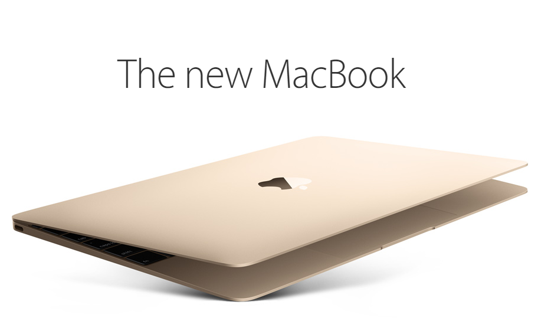
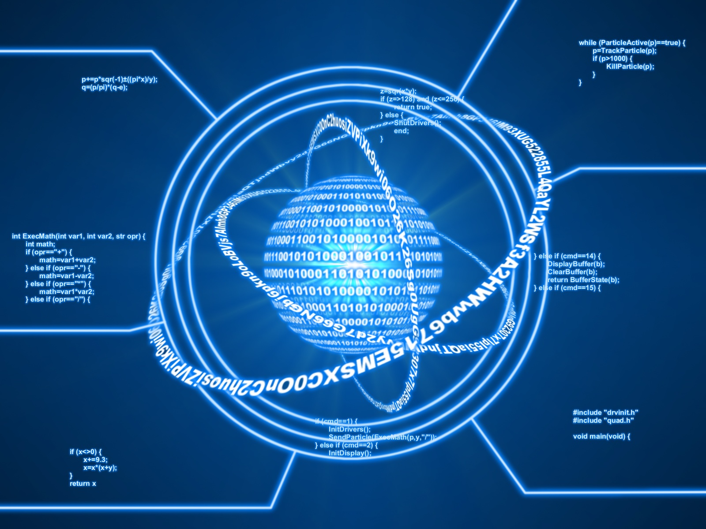
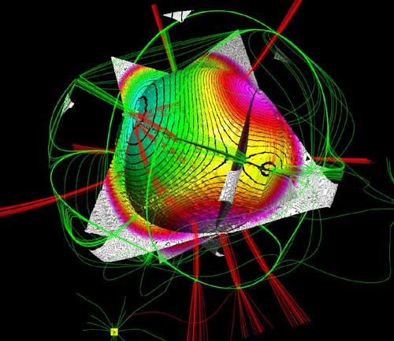
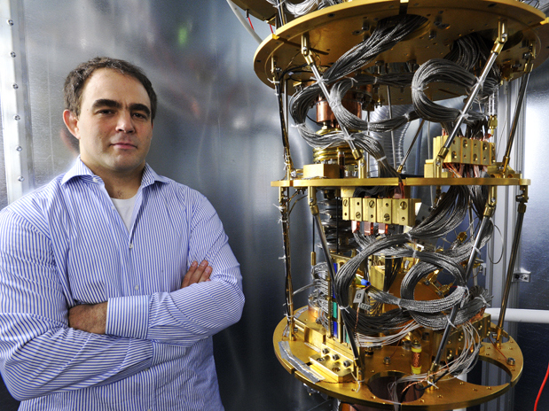
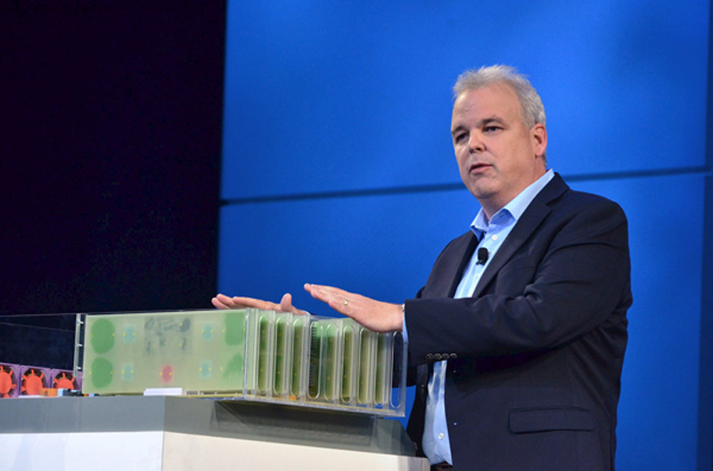

## 背景

如果你知道《模仿游戏》、斯诺登、《超弦理论》、量子力学或量子计算机其中一项，你会不会和我一样，思索着下一个计算时代的模样。

下一代虚拟化技术是Docker？大数据平台Hadoop之后的天下就是Spark？No no no，我们讨论的是计算，我们已经厌烦了图灵和冯诺依曼，我们介绍的是量子计算机。

## 传统计算机

提到传统计算机，我想到了卷福，和他一意孤行制作“轮盘组”的画面。1939年艾伦图灵加入英国海军，花了两年时间创造用于破解Enigma码的“计算机”，电影中的计算机是长这样子的。

有人说阿塔纳索夫-贝瑞计算机（也就是ABC计算机）才是世界上第一台电子计算机，没听过没关系，我也是翻Wiki才知道的，计算机的概念更早的时候就有人提出了。这就是计算机的近代，从20时间19年代开始，冯诺依曼加速了这个时代的发展，传统计算机从一个房间大、好几顿重，到现在的13.1毫米薄、0.91千克重。对，我说的就是2015年苹果发布的The New Mackbook，当前最极致的“传统计算机”。

为了防止有人错过它的惊艳，赶紧贴上The New Macbook的渲染图。

笔记本仍属传统计算机，是因为它同样采购冯诺依曼架构，使用一样的CPU指令集，我们可以用最爱的Go、Java、Python任何编程语言来实现可执行程序。

不能用通用编程语言的平台才算下一代计算机？当然不是，但在视频、游戏发展了相当长的时间后，出现了更高效的编程平台。

## GPU编程

GPU编程属于“现代”编程技术了，我第一次听闻是因为比特币，当时程序员已经知道用普通计算机挖比特币不划算了，开始把重任交给GPU。GPU以其高性能、低能耗（以我这种程度的了解只知道浮点计算时性能可以超高）在特定领域发挥了巨大的作用，游戏、电影、3D建模、挖比特币等等。用GPU可以轻易渲染出这样的效果。

直接使用GPU的方法和CPU有着非常本质的不同，首先通用编程语言是不适用的了，而且根据底层硬件选择不同的框架，比较著名的如OpenCL（全平台通用）、CUDA（NV卡在所有平台可用）、DirectCompute（所有厂商的设备在Windows平台下可用）。GPU构建了计算机的一个轮回，从专用到通用再回归到专用，彻底改变了程序员的编程习惯，我们觉得这是很伟大的一次进步。

补充说一下，JVM、AJAX、MapReduce、Spark和Docker在不同程度上革新了我们对计算的理解，而Google、Facebook、Amazon通过大规模部署服务器也极大提高了计算的效率和能耗，但这都是基于图灵机和冯诺依曼的理论基础，我们更愿意花时间谈谈更revolutionary的。

## 量子计算机

量子计算机以其独特的魅力给我们一次重新思考的机会，不要认为一个bit只能是0或者是1，不要坚信一个计算单元在同一时间只能做一种计算。未来的程序是多维的，有人相信吗？

要理解量子计算机的精妙，首先对量子力学要有大概的认识。量子力学是研究微观物质的物理分支，我们可以认为量子力学是很怪异的科学，很多权威学者也是这样描述的。因为在微观的世界，粒子可以瞬间移动，想想高中物理是不是学过电子的跃迁进而吸收和释放能量，而且粒子可以同时存在多个地方，只有有人观察的时候才能确定其位置，完全是纯概率的。根据已经证明的不确定性原理，在微观的世界，我们不可能同时确定速度和位置，如果我们测量到粒子的速度就不可能知道它的位置。确实是很诡异的科学，甚至是爱因斯坦也因为它的“不符常理”而不愿承认和研究量子物理，但无可争议的是量子物理成为当今最重要的物理理论之一，它启发了后面的弦理论和超弦理论。

OK，我们知道量子物理是很怪异的，一个粒子可以同时出现在多个地方，要计算微观物理的各种公式和现象成了一大难题，现在的计算机太弱了。然后有人说，我们用量子物理的特性来计算量子物理吧，我想你能感受到作者说出这句话后的激动吧。量子计算机就是利用微观粒子的不确定性，在同一个时刻可以出现在多个地方，也就是说可以进行多种计算，甚至是能轻易地穷举一个方程的所有解。有人说，真有这么牛吗？在国外有学院开设了量子计算的课程，老师跟学生说的第一句话就是，以后计算机的所有算法都会变成一种，那就是穷举。

这就是我写这篇文章的目的，So inspiring，计算的未来就在这里，不管是十年还是百年后。接下来我介绍下量子计算的基本概念和到2015年的现况。

我们知道传统计算机最小的存储单元是位（也就是bit），这是由它的实现也就是电路决定的，要么是0要么是1。在量子计算机中，基本单位被称为量子比特，它也是由0和1组成，不同的是它可以同时运算，因此量子比特会是0和1的量子叠加。量子叠加就是2的二次方4吗？很遗憾不是，比这要复杂得多，维基的解释是“在量子力学里，态叠加原理表明，假若一个量子系统的量子态可以是几种不同量子态中的任意一种，则它们的归一化线性组合也可以是其量子态。称这线性组合为“叠加态”。假设组成叠加态的几种量子态相互正交，则这量子系统处于其中任意量子态的概率是对应权值的绝对值平方。”

虽然没看懂，反正里量子比特就不能用0或者1来表示了，它是这个|0>和这个|1>的线性叠加。对于一个二元方程组，普通计算机只能一个方程一个方程解，量子计算机可以同时求所有解，这样好理解了吧。为什么呢？因为在微观的世界，粒子可以同时存在两个地方，如果我们能操控这些粒子的话，我们就可以进行我们想要的计算，这就是量子计算机的原理。操控微观粒子的条件当然也是非常恶劣的，目前唯一商用的量子计算机D-Wave系列必须在接近绝对零度的环境下运行。

说一点更专业的术语，D-Wave采用了相对较新的绝热量子计算机模型—量子退火法。这种架构允许其量子位从叠加态转化为传统计算机的状态。D-Wave的处理器电路是由金属铌制成的，后者然后变成极低温的超导体，这样处理器的温度可以低至零下273.15°。D-Wave处理器被封装在一间屏蔽室内的柱状冷库里面，处理器外面还包裹了16层的屏蔽，可以阻止一切电磁干扰。而包含有量子位的处理器则是由耦合器连接的，外面是一圈可编程的磁存储器。

我们还要知道的是，Google和NASA合订了一台D-wave第二代512位的量子计算机。

2015年1月斯诺登揭露美国政府不惜投入巨资研发量子计算机，一旦研发成功可以轻易破解当前计算机的任何加密算法，“运算速度比电子计算机高出逾10万亿倍，用时30秒就能解决电子计算机100亿年才能解决的问题”。

Fuck，我也想要一台，但以后得放弃编程语言、Linux这一套了，目前已经有基于量子计算机的Python库了，感兴趣的可以下来试试。

## 惠普The Machine

激动人心的量子计算机离我们还有些遥远的，虽然非常期待，另一个值得期待的是HP在2014年的计算机重构项目The Machine。

认为计算机从1940年到现在70多年没有重大突破，惠普觉得需要重新设计计算机的架构，受限于内存和磁盘缓慢的数据交换速度，他们研发了存储介质记忆电阻器，可以同时满足内存的访问速度和磁盘的容量，不知道怎么做到的。CPU使用经过能效和算法优化的系统级芯片，从芯片的内部线路到外部网络设备都用光通信，什么概念呢，我也不清楚，只能说太赞了，效率和能耗肯定有了革命性的提高。操作系统是命名为Linux++的东西，不过这也只是过渡的，最后将会是全新设计的操作系统，那C和C++不一定支持哦。

令人振奋的是The Machine原型机将在2016年面世，无论是成功还是失败，惠普这一步迈得太给力了。HP总裁Fink称这个项目提升了惠普在工程师眼中的地位，“如果你想革新计算架构，惠普是现在唯一在做这件事的公司。”

## 总结

和很多程序员交流过，大家似乎更愿意把精力花在讨论Go、Erlang孰优孰劣上，也有愿意吹捧大数据、物联网的，和小米的冰琳接触后，我深深被最基础的数学和物理所折服。当前的技术是有限的，我们解不了NP完全问题，我们突破不了CAP的限制，但阻止不了我们有更高远的目光。

送给深夜做ACM的Geek们、在Google做基础架构的大神们、在开源社区乐此不疲地帮助别人的Committer们、录制《Cosmos》和《优雅的宇宙》的科学家们，共勉。
